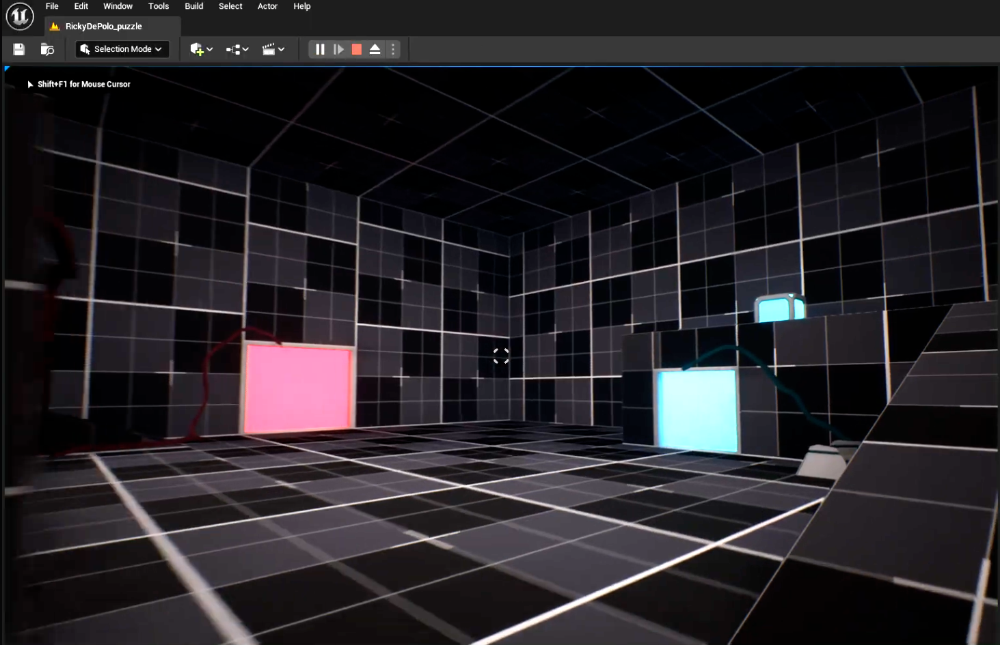

# Level Design

[← Back to Portfolio](index.md)

---

## Level Design Project

> Final project for my level design class at Dallas College SU24; the third section didn't have much thought put into it, unfortunately.

Simple design philosophy of carry-over progression with cubes and puzzles with a touch of platforming.

- **Software Used:** [Unreal Engine]

### Video

[**Youtube Link →**](https://youtu.be/EfIsoZi6nI4)

<iframe
  width="100%"
  height="500"
  src="https://www.youtube.com/embed/EfIsoZi6nI4?si=qwCvYXO4LouUblxi"
  title="Level Design Project"
  frameborder="0"
  allowfullscreen>
</iframe>

---

[← Back to Portfolio](index.md)
