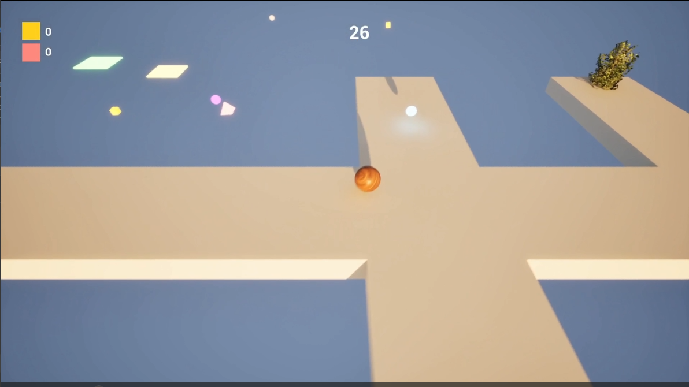
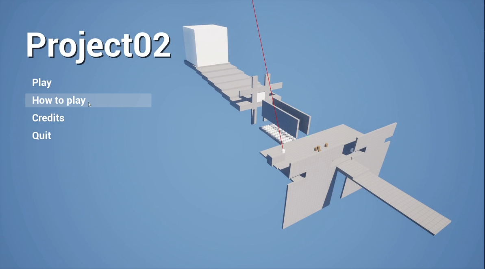
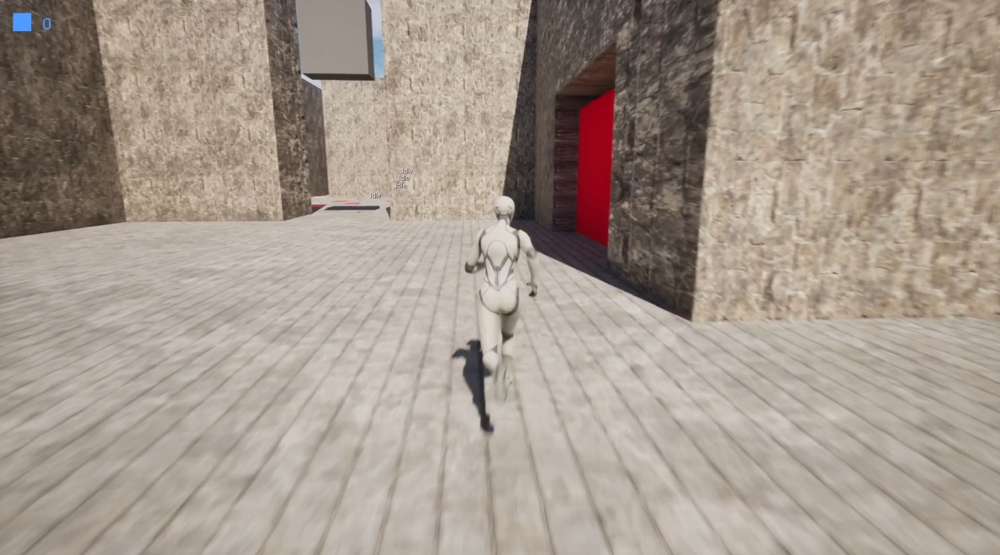

# Scripting for Games
Focused on creating gameplay systems instead of full levels or gameplay loops
- **Software Used:** [Unreal Engine 5]
- **Languages Used:** [Blueprint System in UE5]

[← Back to Portfolio](index.md)

---

## Project 1

> Learned fundamentals of visual scripting in UE5 using blueprints (IA, Widgets, Sound Cues, Niagara Systems).
Used a ton of input actions.
#### What I added outside of class materials - 
The size decrease powerup.

### Video

[**SFG Project 1 Vid Link →**](https://youtu.be/jherv7KNvCM)

<iframe
  width="100%"
  height="500"
  src="https://www.youtube.com/embed/jherv7KNvCM?si=uBfnanfEEw6cvvQ6"
  title="Level Design Project"
  frameborder="0"
  allowfullscreen>
</iframe>

---

## Project 2

> Utilized BP Components and event dispatchers.
Gained a better understanding of the UE physics system.
Utilized Line Trace By Channel and Macros to create the wall running mechanic (used a tutorial for some parts, and even then there are still some bugs, but I’m happy with it for this short project since this was learning I sought outside of class materials).
#### What I added outside of class materials (Order of difficulty for me top > bottom) - 
Added additional functionality to the sprint mechanic created using class tutorials, where the player slows down if they completely run out of stamina.
Reload / limited ammo mechanic,
Turret (damage player function broke while recording, but it still causes barrels to explode).
Explosive crate,
Force push,
Wall Running

### Video

[**SFG Project 2 Vid Link →**](https://youtu.be/Yqe7Cr7bF4I)

<iframe
  width="100%"
  height="500"
  src="https://www.youtube.com/embed/Yqe7Cr7bF4I?si=r0GQKvdrhWJeHvH7"
  title="Level Design Project"
  frameborder="0"
  allowfullscreen>
</iframe>

---

## Project 3

> Utilized inheritance and templates to create a reusable pickup and interact system. 
Gained a better understanding of game states and state-based gameplay, creating mechanics that transition between different behaviors depending on their current state.
Learned and utilized State Trees for both gameplay mechanics and AI.
Created an enemy AI with different states for idling, wandering, and chasing the player, gaining a better understanding of AI behavior and state transitions.
Created an enemy using blackboards and behavior trees.
Gained experience creating more complex gameplay systems by combining states, AI, interactions, and audio / visual feedback.

#### What I added outside of class materials -
Slow Time pickup, 
Thwomp-like trap,
Sticky floors that slow the player while walking over them,
Key door system

#### Issues that I encountered - 
I kept running into unexpected issues with both the state tree AI and behavior tree AI systems. 
In the gameplay video, the AI unexpectedly stopped functioning correctly (the behavior tree didn’t function at all, and the state tree in the room at the beginning chases but then suddenly stops). 
At first, the issue seemed to be properly detecting the player controller, but the systems worked fine in the test levels, and I ran out of time to troubleshoot issues.

### Video

[**SFG Project 3 Vid Link →**](https://youtu.be/DrDMOcbFsaU)

<iframe
  width="100%"
  height="500"
  src="https://www.youtube.com/embed/DrDMOcbFsaU?si=EupUcFy2X1iYHkd2"
  title="Level Design Project"
  frameborder="0"
  allowfullscreen>
</iframe>

---

[← Back to Portfolio](index.md)
