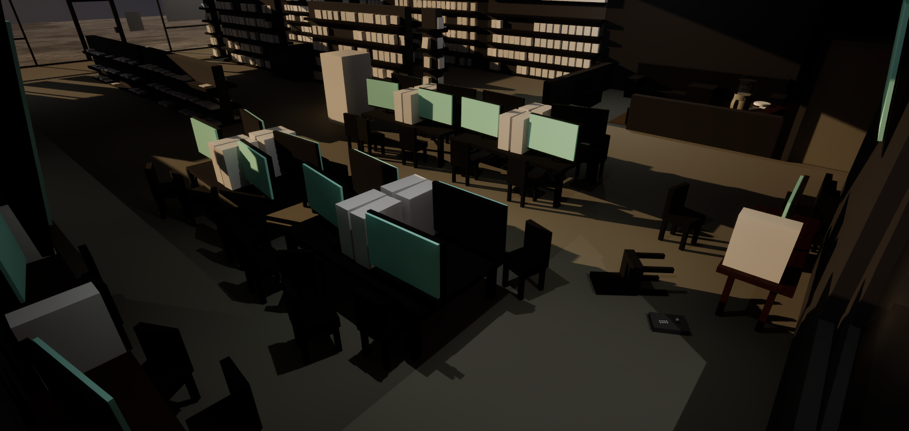
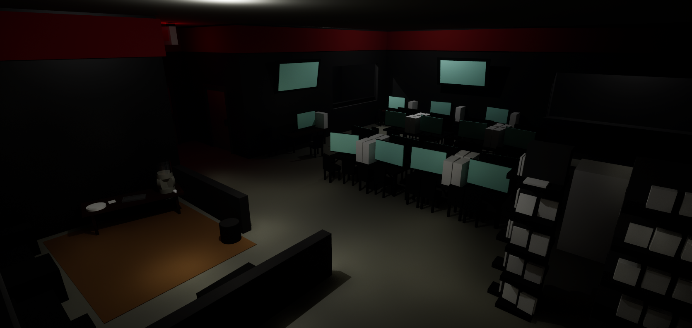
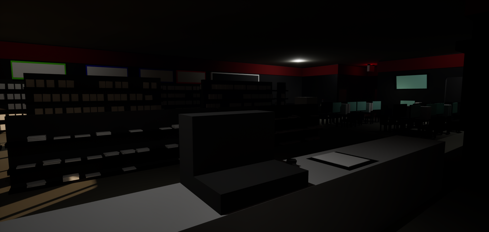
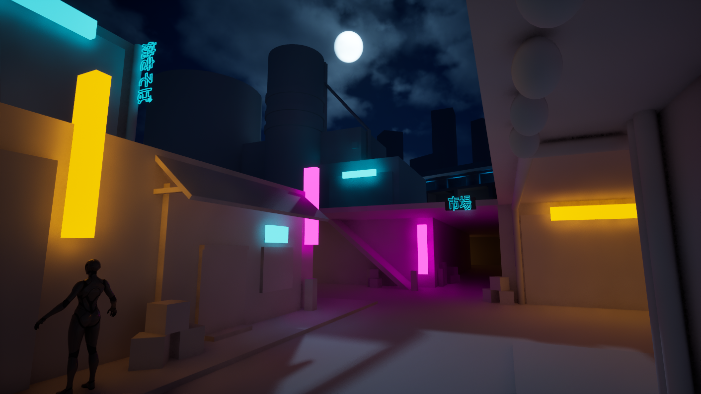
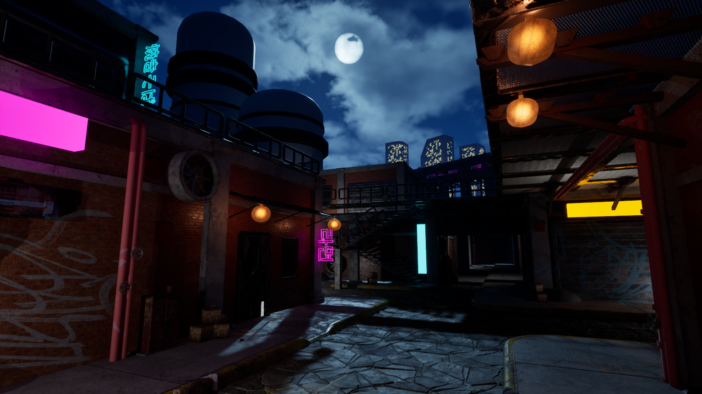

# Virtual Environments

[← Back to Portfolio](index.md)

---

## Project 1 (game shop / local tournament) -

> Reinforced previous learning experiences from level design (blocking out), though instead of playable functionality, it focuses on creating snapshots of environments.

### Project Overview
#### The whole first project was student-made, with the limiting factor being that we were only allowed to use primitives.

### Environment Showcase

*Roof Off since I couldn't figure out lighting at this time*

---

*Roof on*

---
## Project 2 (Cyberpunk Environment) -

> Learned the standard pipeline workflow for creating assets and scenes in Maya and UE5. Gained a better understanding of working through the cameras pov. Reinforced standard modeling fundamentals. Retopology.

### Project Overview
#### The whole first project was student-made, with the limiting factor being that we were only allowed to use primitives.
#### UV unwrapping objects with unique features. Learned how powerful the Adobe software can be when used in combination with each other (such as transferring things like already created features from Sampler to Painter).
#### Learned how to create and utilize materials, smart materials, brushes, and more in Substance Painter.

### Environment Showcase

*Initial Blockout*

---

*Final Pass*

---

[← Back to Portfolio](index.md)
